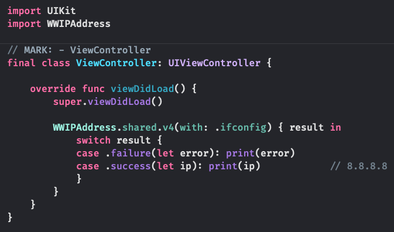

# WWIPAddress
[](https://developer.apple.com/swift/) [](https://developer.apple.com/swift/)  [](https://developer.apple.com/swift/) [](https://developer.apple.com/swift/)

## [Introduction - 簡介](https://swiftpackageindex.com/William-Weng)
- Get the external IP address of the mobile phone.
- 取得該手機對外的IP地址。



### [Installation with Swift Package Manager](https://medium.com/彼得潘的-swift-ios-app-開發問題解答集/使用-spm-安裝第三方套件-xcode-11-新功能-2c4ffcf85b4b)
```
dependencies: [
    .package(url: "https://github.com/William-Weng/WWIPAddress.git", .upToNextMajor(from: "1.0.0"))
]
```

## [Function - 可用函式](https://ezgif.com/video-to-webp)
|函式|功能|
|-|-|
|detail(with:timeout:result:)|取得對外IP相關資訊|
|v4(with:timeout:result:)|取得對外IPv4地址|
|information(with:timeout:result:)|反查IP相關資訊|

## [Example](https://ezgif.com/video-to-webp)
```swift
import UIKit
import WWIPAddress

final class ViewController: UIViewController {

    override func viewDidLoad() {
        super.viewDidLoad()
        
        WWIPAddress.shared.v4(with: .ifconfig) { result in
            switch result {
            case .failure(let error): print(error)
            case .success(let ip): print(ip)
            }
        }
    }
}
```
